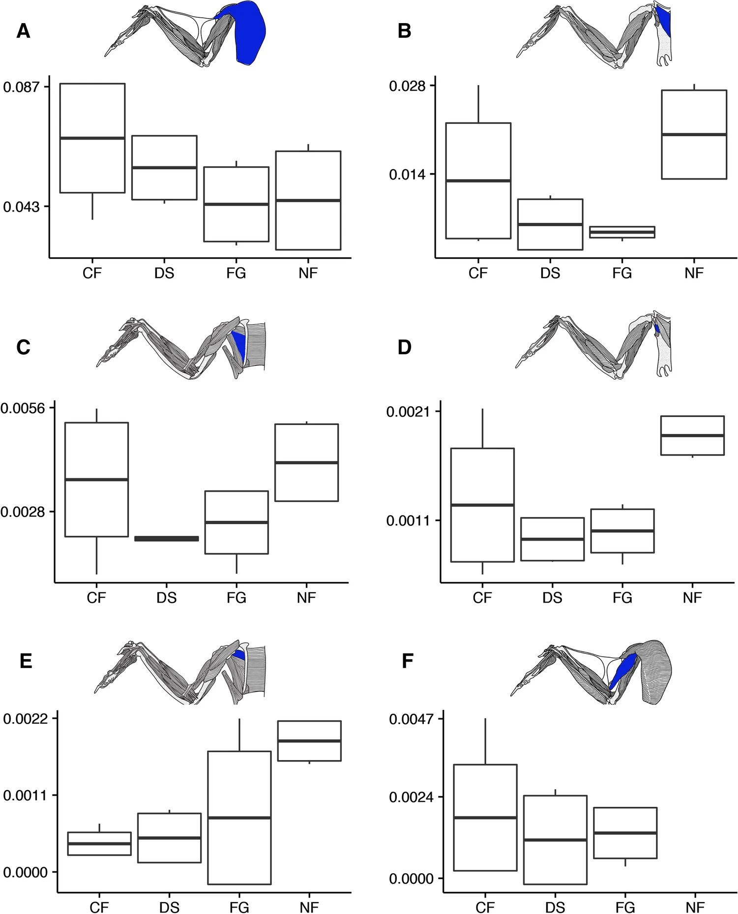

```datacorejsx
return function NodeSetup() {
  const current = dc.useCurrentFile();
  const aliases = current.value("aliases");
  if (aliases && aliases.length > 0) return null;

  const handleClick = async () => {
    const full = current.$name;
    const MAX = 60;
    const slug = full.replace(/[?:*"<>|\\]/g, '').slice(0, MAX).trimEnd();
    const file = app.vault.getAbstractFileByPath(current.$path);
    if (!file) return;

    await app.fileManager.processFrontMatter(file, fm => {
      fm.aliases = [full];
    });

    if (slug !== full) {
      const newPath = `${file.parent.path}/${slug}.md`;
      await app.fileManager.renameFile(file, newPath);
    }
  };

  return <button onClick={handleClick}>Save full title as alias</button>;
}
```
>[!warning]- 
>This Evidence node originally contained a "/" symbol (replaced with "per"), which is not a valid filename character. The ** save full title as alias** button will strip "?" and shorten your node titles but some characters like "/", "\", & ":" are immediately fatal on most OSes -- avoid and replace these before creating nodes. Remember: nodes are filenames!

> [!tip]- 
> This Evidence node contains a property called "centrality" which is meant to convey the importance of these data to the Claim they inform/support/oppose. You can create different or additional properties to add nuance to your argument.

# Evidence Summary

> [!tip]-
>  You can restate the EVD in your own words, link to additional components of the EVD bundle, or include more of the chain of inference.

[[EVD - Avian flight musculature avgs ~ 20% of total body mass]] - [@biewenerBiomechanicsAvianFlight2022]

> [!tip] The Evidence summary should include a link to the Source

# Grounding Context
> [!info]- 
>  This space can be used to include context about the methods used to generate this EVD

1. Dissection
2. Weighing & measurement of dissected flight muscle
3. Statistical analysis|

